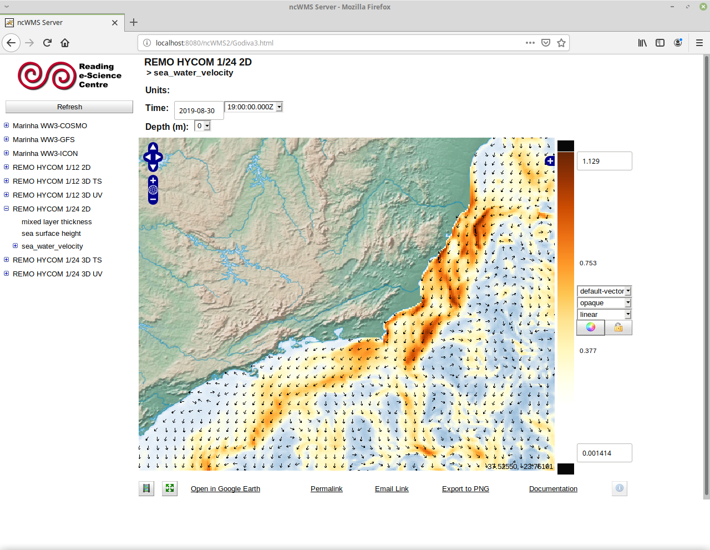

# Installing instructions for Tomcat, THREDDS, ncWMS, ERDDAP and GeoServer


This document contains some simple instructions to install a [Tomcat](http://tomcat.apache.org/) server and deploy [THREDDS](https://github.com/Unidata/thredds) (a.k.a. TDS, a.k.a Thematic Real-time Environmental Distributed Data Services), [ncWMS](https://reading-escience-centre.github.io/ncwms/) (a.k.a. Godiva2, a.k.a. Godiva3), [ERDDAP](https://coastwatch.pfeg.noaa.gov/erddap/index.html) and [GeoServer](http://geoserver.org/) over.

References:
- [Getting Started With the TDS: Local Test Server Setup](https://www.unidata.ucar.edu/software/thredds/current/tds/tutorial/GettingStarted.html)
- [TDS Reference Documentation](https://www.unidata.ucar.edu/software/thredds/current/tds/reference/)
- [TDS Online Tutorial](https://docs.unidata.ucar.edu/thredds/tds/5.0.0/userguide/tds_tutorial_index.html)
- [ncWMS User Guide](https://reading-escience-centre.gitbooks.io/ncwms-user-guide/content/)
- [EDAL User Guide](https://reading-escience-centre.gitbooks.io/edal-user-guide/)

Tested on the following system:
`Linux 5.3.0-46-generic x86_64 GNU/Linux`

---

## Install Tomcat

The main directory will be `/usr/local/tds`. There is no need to run the application as root, it's safer to run as a regular user.
```
sudo mkdir /usr/local/tds
sudo chown my_user:my_user /usr/local/tds
```
Get latest [Java JDK](https://www.oracle.com/technetwork/pt/java/javase/downloads/index.html). At the time this is `jdk-8u241-linux-x64.tar.gz`. You need to create a Oracle account do download the file, but it is free.

```
tar -xzvf jdk-8u241-linux-x64.tar.gz -C /usr/local/tds
cd /usr/local/tds
ln -s jdk1.8.0_241 java
```

Get the latest [Tomcat 8](https://tomcat.apache.org/download-80.cgi). At the time this is `apache-tomcat-8.5.53.tar.gz`. Be careful to download the one listed under `Binary Distributions -> Core` and not one of the others (e.g. Deployer, Source).

```
tar -xzvf apache-tomcat-8.5.53.tar.gz -C /usr/local/tds
cd /usr/local/tds
ln -s apache-tomcat-8.5.53 tomcat
```

The directory tree will be:
```
$ /bin/ls -l /usr/local/tds/

apache-tomcat-8.5.53
java -> jdk1.8.0_241
jdk1.8.0_241
tomcat -> apache-tomcat-8.5.53
```

Create the file `/usr/local/tds/tomcat/bin/setenv.sh`. This file defines some configurations necessary for Tomcat/TDS.

```
#!/bin/sh
#
# ENVARS for Tomcat
#
export CATALINA_HOME="/usr/local/tds/tomcat"

export CATALINA_BASE="/usr/local/tds/tomcat"

export JAVA_HOME="/usr/local/tds/java"

# TDS specific ENVARS
#
# Define where the TDS content directory will live
#   THIS IS CRITICAL and there is NO DEFAULT - the
#   TDS will not start without this.
#
CONTENT_ROOT=-Dtds.content.root.path=/usr/local/tds/tomcat/content

# set java prefs related variables (used by the wms service, for example)
JAVA_PREFS_ROOTS="-Djava.util.prefs.systemRoot=$CATALINA_HOME/content/thredds/javaUtilPrefs \
                  -Djava.util.prefs.userRoot=$CATALINA_HOME/content/thredds/javaUtilPrefs"

#
# Some commonly used JAVA_OPTS settings:
#
NORMAL="-d64 -Xmx4096m -Xms512m -server -ea"
HEAP_DUMP="-XX:+HeapDumpOnOutOfMemoryError"
HEADLESS="-Djava.awt.headless=true"

#
# Standard setup.
#
JAVA_OPTS="$CONTENT_ROOT $NORMAL $MAX_PERM_GEN $HEAP_DUMP $HEADLESS $JAVA_PREFS_ROOTS"

export JAVA_OPTS
```
`-Xmx` defines the maximum RAM memory available for the server. Change this accordling to the computer resources.

If Tomcat is behind a proxy (usual in a corporate setup), you can configure the server to access the internet using a modified script like the one bellow. This configuration allows the server (and applets) to access the internet if needed, the client (the user's browser) needs it owns configuration to access the external network.

```
#!/bin/sh
#
# ENVARS for Tomcat
#
export CATALINA_HOME="/usr/local/tds/tomcat"

export CATALINA_BASE="/usr/local/tds/tomcat"

export JAVA_HOME="/usr/local/tds/java"

# TDS specific ENVARS
#
# Define where the TDS content directory will live
#   THIS IS CRITICAL and there is NO DEFAULT - the
#   TDS will not start without this.
#
CONTENT_ROOT=-Dtds.content.root.path=/usr/local/tds/tomcat/content

# set java prefs related variables (used by the wms service, for example)
JAVA_PREFS_ROOTS="-Djava.util.prefs.systemRoot=$CATALINA_HOME/content/thredds/javaUtilPrefs \
                  -Djava.util.prefs.userRoot=$CATALINA_HOME/content/thredds/javaUtilPrefs"

#
# Some commonly used JAVA_OPTS settings:
#
NORMAL="-d64 -Xmx4096m -Xms512m -server -ea"
HEAP_DUMP="-XX:+HeapDumpOnOutOfMemoryError"
HEADLESS="-Djava.awt.headless=true"

#
# proxy configuration
#
PROXY="-Dhttp.proxySet=true \
       -Dhttp.proxyHost=proxy.mycompany.com \
       -Dhttp.proxyPort=8080 \
       -Dhttp.proxyUser=user \
       -Dhttp.proxyPassword=password \
       -Dhttp.nonProxyHosts='localhost|127.0.0.1|*.mycompany.com' \
       -Dhttps.proxySet=true \
       -Dhttps.proxyHost=proxy.mycompany.com \
       -Dhttps.proxyPort=8080 \
       -Dhttps.proxyUser=user \
       -Dhttps.proxyPassword=password \
       -Dhttps.nonProxyHosts='localhost|127.0.0.1|*.mycompany.com'"

#
# Standard setup.
#
JAVA_OPTS="$CONTENT_ROOT $NORMAL $MAX_PERM_GEN $HEAP_DUMP $HEADLESS $JAVA_PREFS_ROOTS $PROXY"

export JAVA_OPTS
```


Give execution attributes with:
```
chmod +x /usr/local/tds/tomcat/bin/setenv.sh
```

To use Tomcat's manager app, it is mandatory to define some extra roles and an username/password in `/usr/local/tds/tomcat/conf/tomcat-users.xml`

```
<tomcat-users ...>

  <role rolename="admin-gui" />
  <role rolename="admin-script" />
  <role rolename="manager-gui" />
  <role rolename="manager-script" />
  <role rolename="manager-jmx" />
  <role rolename="manager-status" />
  <role rolename="ncWMS-admin" />
  <user username="my_user" password="my_password" roles="admin-gui,admin-script,manager-gui,manager-script,manager-jmx,manager-status,ncWMS-admin" />

</tomcat-users>
```
P.S.: ncWMS-admin will be used to log in ncWMS admin interface.

Following [Special note about Tomcat](https://github.com/Unidata/thredds/releases/tag/v4.6.13), some special characters used in TDS queries must be allowed in `/usr/local/tds/tomcat/conf/server.xml` using the `relaxedQueryChars` parameter in the `Connector` definition:

```
    <Connector port="8080" protocol="HTTP/1.1"
               connectionTimeout="20000"
               redirectPort="8443"
               relaxedQueryChars="[]" />
```

Start Tomcat with:
```
/usr/local/tds/tomcat/bin/startup.sh
```

 Check if is running with `ps aux | grep -i tomcat` and going to http://localhost:8080/ in a browser. The manager app is available in http://localhost:8080/manager/html, using the username/password defined in `tomcat-users.xml`.

To stop Tomcat:
```
/usr/local/tds/tomcat/bin/shutdown.sh
```


## Deploy THREDDS

If everything is working, now it is time do deploy the THREDDS server. Download the latest TDS war file from [Github](https://github.com/Unidata/thredds/releases). At the time this is `tds-4.6.14.war`. Make a copy of the file following Tomcat naming conventions. If Tomcat is running, the war file will be automatically unpacked.

```
cp tds-4.6.14.war /usr/local/tds/tomcat/webapps/thredds##4.6.14.war
```

Go to http://localhost:8080/thredds to check if TDS is up and running.


Now lets change some TDS options. Shutdown Tomcat and edit file `/usr/local/tds/tomcat/content/thredds/catalog.xml` enabling some additional services.

```
  <service name="all" base="" serviceType="compound">
    <service name="odap" serviceType="OpenDAP" base="/thredds/dodsC/" />
    <!-- service name="dap4" serviceType="DAP4" base="/thredds/dap4/" /-->
    <service name="http" serviceType="HTTPServer" base="/thredds/fileServer/" />
    <service name="wcs"  serviceType="WCS" base="/thredds/wcs/" />
    <service name="wms"  serviceType="WMS" base="/thredds/wms/" />
    <service name="ncss" serviceType="NetcdfSubset" base="/thredds/ncss/" />
    <service name="ncml" serviceType="NCML" base="/thredds/ncml/"/>
    <service name="uddc" serviceType="UDDC" base="/thredds/uddc/"/>
    <service name="iso"  serviceType="ISO" base="/thredds/iso/"/>
  </service>
```

In the file `/usr/local/tds/tomcat/content/thredds/threddsConfig.xml` uncomment and activate (`<allow>true</allow>`) the following services:

- Netcdf Subset Service
- WCS
- WMS
- NCISO

e.g.

```
  <!--
  The Netcdf Subset Service is off by default. -->
  <NetcdfSubsetService>
    <allow>true</allow>
    <scour>10 min</scour>
    <maxAge>-1 min</maxAge>
  </NetcdfSubsetService>
```

[This](https://www.unidata.ucar.edu/software/thredds/current/tds/reference/ThreddsConfigXMLFile.html) shows the documentation for the options available in `threddsConfig.xml` and [this](https://github.com/Unidata/TdsConfig/blob/master/thredds/threddsConfig.xml) shows the actual `threddsConfig.xml` used in the [operational Unidata TDS](https://thredds.unidata.ucar.edu/thredds/catalog/catalog.html). As a side note, you can see the current development version of TDS in action [here](https://thredds-test.unidata.ucar.edu/thredds/catalog/catalog.html).

## Deploy ncWMS

ncWMS is a Web Map Service specialed tailored to serve images/maps reading data from NetCDF files. THREDDS already has a internal version of ncWMS, but installing a standalone version alongside offers some advantages:

- in THREDDS each individual dataset has it's own visualization page (Godiva2) where the variables can be analyzed, but comparing different datasets is difficult as each dataset has to be open in different webpage. In a standalone ncWMS installation over Tomcat, the app can be configured to show all the datasets in a single page, making comparisons between datasets much easier.
- THREDDS has a earlier implementation of ncWMS (version 1.x) than the one available as standalone (version 2.x).
- it is easier to make small changes in the visualization (e.g. basemap, color pallets) in the standalone version.

Download the latest ncWMS2 war file from [Github](https://github.com/Reading-eScience-Centre/ncwms/releases). At the time this is version 2.4.2. Make a copy of the file following Tomcat naming conventions. If Tomcat is running, the war file will be automatically unpacked.

```
cp ncWMS2.war /usr/local/tds/tomcat/webapps/ncWMS2##2.4.2.war
```

Go to http://localhost:8080/ncWMS2/Godiva3.html to check if ncWMS is up and running. The standard installation comes with no datasets.


You can add new datasets using the "Admin interface" in http://localhost:8080/ncWMS2/ . This interface allows the user to apply some definitions by dataset and variable (e.g. name, color range).

To change global app configurations, like what is the default color palette used or where the new styles files should be located, the user has to change the file `/usr/local/tds/tomcat/webapps/ncWMS2##2.4.2/WEB-INF/web.xml`. To change the default color palette to a "rainbow" type palette:
```
    <context-param>
        <!-- This specifies the default palette to use (i.e. the palette returned by the string "default"). It can be a predefined palette or a string of the form: 0x[AA]RRGGBB,0x[AA]RRGGBB,0x[AA]RRGGBB,... -->
        <param-name>defaultPalette</param-name>
        <!-- <param-value>seq-BuYl</param-value> -->
        <param-value>x-Occam</param-value>
    </context-param>
```

By default, all the user configuration files are stored in `$HOME/.ncWMS2`. New color palettes can be created in `$HOME/.ncWMS2/.palettes` and new plot styles in `$HOME/.ncWMS2/.styles`. This same folder holds the `godiva3.properties` file where the user can add extra base or overlay layers in the Godiva3 map. Within this file the user can also change the size of the map from the default (`mapHeight=600, mapWidth=750`) to a size more fitting a widescreen monitor (e.g. `mapHeight=730,
mapWidth=1180`). If `mapHeight` or `mapWidth` are greater than 1024 pixels, you also need to change the maximum allowed width and height in the `$HOME/.ncWMS2/config.xml` to something like:

```
        <maxImageWidth>2048</maxImageWidth>
        <maxImageHeight>2048</maxImageHeight>
```

### Add new basemaps and overlay layers

The user can add new basemaps and auxiliary overlay layers following the instructions in `$HOME/.ncWMS/godiva3.properties`. Bellow a example adding two new baselayers based on [Open Street Map](https://www.openstreetmap.org/). The baselayers use OSM data but are made available as a WMS by the good people at [terrestris](https://www.terrestris.de/en). The overlay layer is useful to show places names when dealing with atmospheric data that covers the land.

```
# Color Basemap by Open Street Map provided by https://www.terrestris.de
osmcURL=https://ows.terrestris.de/osm/service?
osmcTitle=OpenStreetMap-terrestris-color
osmcLayers=OSM-WMS
osmcProjection=EPSG:4326
osmcVersion=1.1.1
osmcFormat=image/png
osmcOnByDefault=true
osmcIsOverlay=false

# Gray Basemap by Open Street Map provided by https://www.terrestris.de
osmgURL=https://ows.terrestris.de/osm-gray/service?
osmgTitle=OpenStreetMap-terrestris-gray
osmgLayers=OSM-WMS
osmgProjection=EPSG:4326
osmgVersion=1.1.1
osmgFormat=image/png
osmgOnByDefault=false
osmgIsOverlay=false

# Overlay with places names by Open Street Map provided by https://www.terrestris.de
osmoURL=https://ows.terrestris.de/osm/service?
osmoTitle=OpenStreetMap-terrestris-overlay
osmoLayers=OSM-Overlay-WMS
osmoProjection=EPSG:4326
osmoVersion=1.1.1
osmoFormat=image/png
osmoOnByDefault=false
osmoIsOverlay=true
```

### Color palettes

New color palette files must have the `.pal` extension and one color per line in hex format. You can get a palette from a site like [ColorBrewer]([http://colorbrewer2.org/#type=sequential&scheme=YlOrBr&n=9) or build your own from rbg colors. To convert rgb values to hex in python:

```
def rgb2hex(r, g, b, alpha=100):

    def clamp(x):
        return max(0, min(x, 255))

    return "#{:02x}{:02x}{:02x}{:02x}".format(
        clamp(int(round(255 * alpha/100))), clamp(r), clamp(g), clamp(b))
```

Palettes can be in #rrbbgg or #aarrbbgg where aa stands for the alpha (opacity) channel. If omitted the opacity is 100%, e.g.:

```
#ffffff
#ffffff
#ffffff
#ffffe5
#fff7bc
#fee391
#fec44f
#fe9929
#ec7014
#cc4c02
#993404
#662506
```


Adding the alpha channel is specially useful to make the lower bound of a scalar field transparent, so that regions with lower values don't stand out too much. Bellow the same palette, but with the first three levels in different levels of opacity (in hex 33=20%, 66=40%, 99=%60) and all the other levels with full (in hex FF=100%) opacity. The blue that shows comes from the background map.

```
#33ffffff
#66ffffff
#99ffffff
#FFffffe5
#FFfff7bc
#FFfee391
#FFfec44f
#FFfe9929
#FFec7014
#FFcc4c02
#FF993404
#FF662506
```


### Styles

 Below a example showing a new style combining colormap and contours. If inserted in the file `$HOME/.ncWMS2/.styles/scalar-contour.xml` the new style will appear with the name `scalar-contour` in the drop down list right of the plot.

```
<?xml version="1.0" encoding="ISO-8859-1"?>
<StyledLayerDescriptor version="1.1.0" xsi:schemaLocation="http://www.opengis.net/sld
StyledLayerDescriptor.xsd" xmlns="http://www.opengis.net/sld" xmlns:ogc="http://www.opengis.net/ogc"
xmlns:se="http://www.opengis.net/se" xmlns:xlink="http://www.w3.org/1999/xlink"
xmlns:xsi="http://www.w3.org/2001/XMLSchema-instance" xmlns:resc="http://www.resc.reading.ac.uk">

  <NamedLayer>
    <se:Name>$layerName</se:Name>
    <UserStyle>
      <se:CoverageStyle>
        <se:Rule>
          <se:RasterSymbolizer>
            <se:Opacity>$opacity</se:Opacity>
            <se:ColorMap>
              <resc:Segment fallbackValue="$bgColor">
                <se:LookupValue>Rasterdata</se:LookupValue>
                <resc:BelowMinValue>$belowMinColor</resc:BelowMinValue>
                <resc:ValueList>
                  <se:Name>$paletteName</se:Name>
                </resc:ValueList>
                <resc:AboveMaxValue>$aboveMaxColor</resc:AboveMaxValue>
                <resc:Range>
                  <resc:Minimum>$scaleMin</resc:Minimum>
                  <resc:Maximum>$scaleMax</resc:Maximum>
                  <resc:Spacing>$logarithmic</resc:Spacing>
                </resc:Range>
                <resc:NumberOfSegments>$numColorBands</resc:NumberOfSegments>
              </resc:Segment>
            </se:ColorMap>
          </se:RasterSymbolizer>
        </se:Rule>
      </se:CoverageStyle>
    </UserStyle>
  </NamedLayer>

  <NamedLayer>
    <se:Name>$layerName</se:Name>
    <UserStyle>
      <se:CoverageStyle>
        <se:Rule>
          <resc:ContourSymbolizer>
            <se:Opacity>$opacity</se:Opacity>
            <resc:NumberOfContours>5</resc:NumberOfContours>
            <resc:ContourLineColour>black</resc:ContourLineColour>
            <resc:ContourLineWidth>1</resc:ContourLineWidth>
            <resc:ContourLineStyle>SOLID</resc:ContourLineStyle>
            <resc:LabelEnabled>true</resc:LabelEnabled>
            <resc:Range>
              <resc:Minimum>$scaleMin</resc:Minimum>
              <resc:Maximum>$scaleMax</resc:Maximum>
              <resc:Spacing>$logarithmic</resc:Spacing>
            </resc:Range>
            <resc:AutoRangeEnabled>false</resc:AutoRangeEnabled>
          </resc:ContourSymbolizer>
        </se:Rule>
      </se:CoverageStyle>
    </UserStyle>
  </NamedLayer>

</StyledLayerDescriptor>
```

 

ncWMS2 even has a tool to test new styles in `http://localhost:8080/ncWMS2/sldtest.html`. Several examples and references can be found in:

- https://github.com/Reading-eScience-Centre/edal-java/tree/master/graphics/src/main/resources/styles
- https://reading-escience-centre.gitbooks.io/ncwms-user-guide/content/06-development.html#styles
- https://reading-escience-centre.gitbooks.io/edal-user-guide/content/appendices/sld_spec/introduction.html
- http://www.geoviqua.org/Docs/03_ncWMS_Styling_Specification_1.0.pdf
- https://reading-escience-centre.gitbooks.io/edal-user-guide/content/appendices/sld_spec/introduction.html

[comment]: <> (Find some way to plot current/wind vector over a scalar field like ssh, ssh)

## Deploy ERDDAP
@todo

## Deploy GeoServer
@todo
